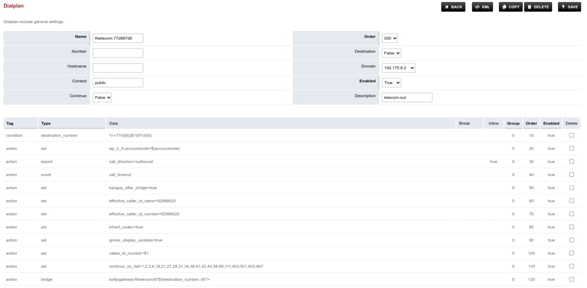

Freeswitch
===================================================================================

Настройка маршрута Казахтелеком
_____________________________________

Tele2 outbound route
_____________________________________

.. code-block:: xml

	<extension name="tele2">
	  <condition field="destination_number" expression="^(\+77\d{9})$|^(87\d{9})$">
		<action application="set" data="effective_caller_id_number=+77085052463"/>
		<action application="bridge" data="sofia/gateway/tele2/+77${destination_number:-9}"/>
	  </condition>
	</extension>

Tele2 GateWay
_____________________________________

.. code-block:: xml

	<include>
	  <gateway name="tele2">
	  <param name="username" value="user"/>
	  <param name="from-user" value="user"/>
	  <param name="password" value="password"/>
	  <param name="proxy" value="217.76.71.17"/>
	  <param name="expire-seconds" value="60"/>
	  <param name="register" value="true"/>
	  </gateway>
	</include>

MP3 Recording
____________________________________

.. code-block:: text

	download https://centos.pkgs.org/6/okey-x86_64/freeswitch-format-mod-shout-1.6.8-1.el6.x86_64.rpm.html
	extract file mod_shout.so to /usr/local/freeswitch/mod/

	yum install libshout
	yum install lame-libs
	yum install libmpg123
	ln -s /usr/lib64/libpcre.so.1 /usr/lib64/libpcre.so.0

	fs_cli
	> load mod_shout

PostgreSQL Support
____________________________________

.. code-block:: text

	apt install libpq-dev -y
	./configure --enable-core-pgsql-support -C
	make
	make install

Additional
____________________________________

.. code-block:: text

	apt install libavformat-dev -y
	apt install libswscale-dev -y
	apt install libv8-dev -y
	apt install libpq-dev -y
	apt install bison -y
	apt install libshout3-dev -y
	apt install libmpg123-dev -y
	apt install libmp3lame-dev -y
	
Error: * * * You must install libmpg123-dev to build mod_shout. Stop
____________________________________________________________________________________________________________

найдем libmpg123.pc :

.. code-block:: text

	# find /usr/*  -name 'libmpg123.pc'
	/usr/lib64/pkgconfig/libmpg123.pc
	/usr/local/lib/pkgconfig/libmpg123.pc

выполним export PKG_CONFIG_PATH= указав директории в которых нашлись libmpg123.pc

.. code-block:: text

	export PKG_CONFIG_PATH=/usr/local/lib/pkgconfig:/usr/lib64/pkgconfig