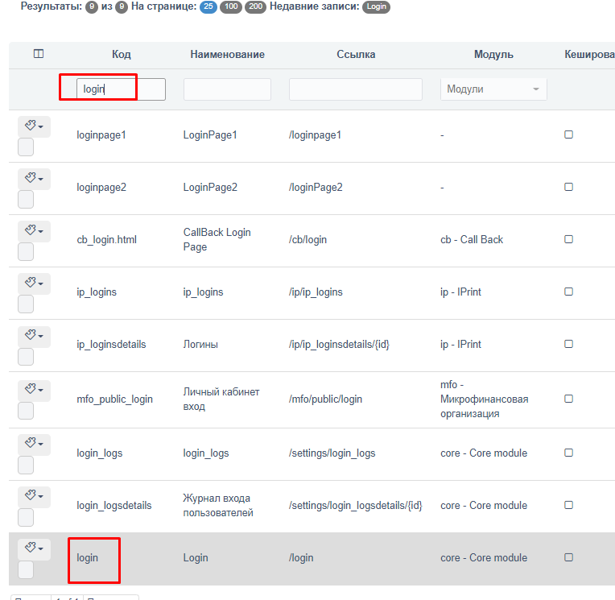
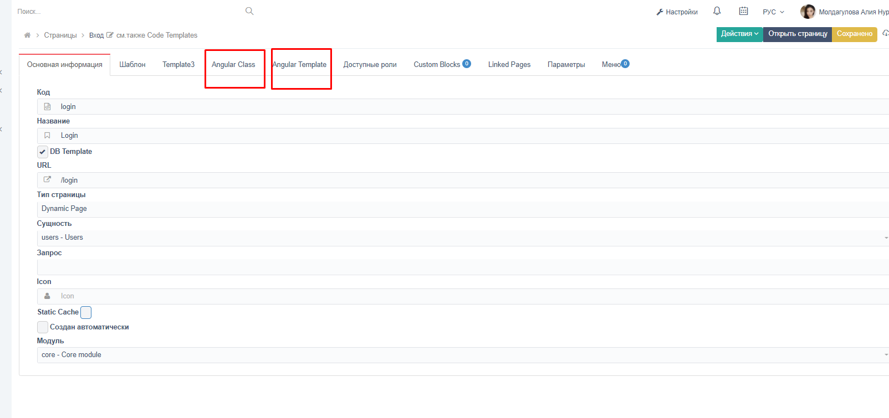

:Author: yeldars

Порядок разработки страниц для мобильных приложений в DamuBPM.
==============================================================

| 

Данное руководство описывает процесс разработки мобильных экранных
страниц для применения их в WebView.

Страницы
--------

| 

Пример страницы в неавторизованной зоне:
~~~~~~~~~~~~~~~~~~~~~~~~~~~~~~~~~~~~~~~~

| 

Настройка->Страницы

| 

|image1|

| 

| 

Щелкаем на строку, открывается редактор страницы:

| 

| 

|image2|

| 

Эти две вкладки отвечают за верстку и логику страницы.

| 

Эта страница будет доступна в режиме инкогнито или в незалогиненном
состоянии по ссылке

<host>/auth/login

| 

Авторизованные страницы
~~~~~~~~~~~~~~~~~~~~~~~

| 

Авторизованные страницы имеют ссылку в следующем виде:

<host>/КодСтраницы

| 

| 

Angular Class
~~~~~~~~~~~~~

| 

Глобальные функции:

При инициализации страницы

ngOnInit() {

}

При рендеринге странице

ngAfterViewInit () {

}

| 

Ссылка на FAQ по разработке Angular Class:

| 

-  `Пример вызова Rest
   Service <angular_restapi.html>`__

-  `Как получить список (запрос) в
   Angular <angular_query.html>`__

-  `Доступ к параметрам из
   Angular <angular_params.html>`__

-  `Запуск бизнес-процесса из
   Angular <angular_start_bp.html>`__

-  `Как получить детализацию в
   Angular <angular_detail.html>`__

| 

| 

Angular Template
~~~~~~~~~~~~~~~~

| 

Шаблон разрабатывается на основе Bootstrap 5
https://getbootstrap.com/docs/5.0/getting-started/introduction/

иPrime NG v13\ https://www.primefaces.org/primeng/showcase/#/setup

| 

После изменения шаблона и нажатия кнопку Сохранить изменения сразу
применяются.

