Описание работы ЭЦП в DamuBPM
==================================================================================================

Формирование ЭЦП на JavaScript
----------------------------------------

Если в маршруте документа указан вид задачи «Подписание», то документ должен пройти процедуру подписание посредством наложения электронной цифровой подписи.

 
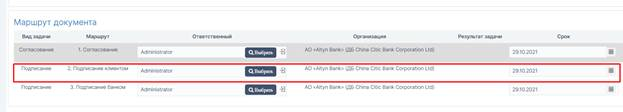
  
  
При назначении задачи «Подписание» у подписанта появляется соответствующая кнопка:
 
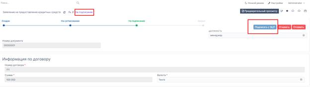
  

При нажатии на «Подписать с ЭЦП» открывается диалоговое окно:
Необходимо

1.	Выбрать файл GOST – Закрытый ключ в формате .p12 для наложения ЭЦП файл 

2.	Ввести пароль от закрытого ключа

При наложении ЭЦП:

1.	закрытый ключ не отправляется на сервер:

Как видим, нет сетевой активности:

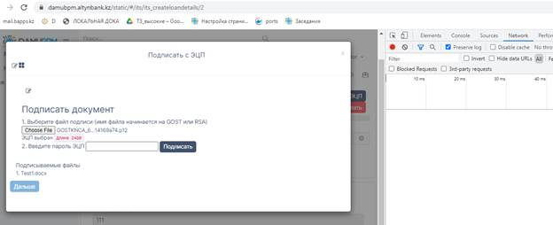

2.	подписание происходит через браузерные библиотеки web-crypto алгоритмом GOST 34.311-95 with GOST 34.310-2004(1.2.398.3.10.1.1.1.2)
3.	Подписывается вложенный файл в формате Base64

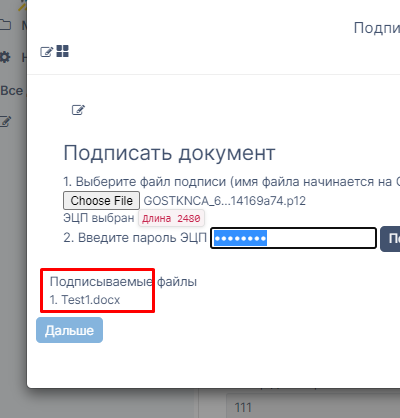

Валидация ЭЦП на сервере
----------------------------------------

2.1.	Отправляется открытая ЭЦП на сервер, а также подписываемый файл:

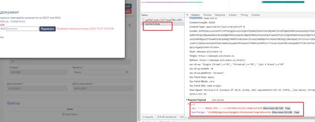

В ответ получаем ок:

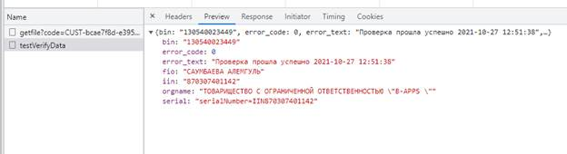

2.2. Пункты Валидации.
1.	Проверка на отзыв сертификата
2.	Проверка срока действия сертификата
3.	Проверка принадлежности по БИН организации
4.	Проверка целостности методом Kalkan VerifyData
5.	Проверка корневых сертификатов
6.	Проверка на алгоритм GOST 34.311-95 with GOST 34.310-2004(1.2.398.3.10.1.1.1.2)

Наложение Временной метки (Timestamp / TSP)
------------------------------------------------------

При нажатии на кнопку Дальше продолжается процесс согласно схеме BPMN:

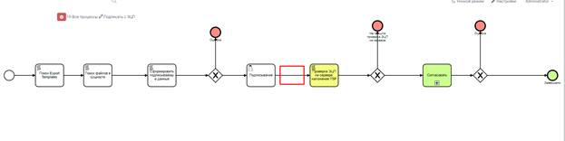

Происходит дополнительная валидация ЭЦП на сервере (см 2.2. Пункты Валидации).

Наложение Метки времени (TimeStamp / TSP через http://tsp.pki.gov.kz) на сервере и наложение OCSP через (http://ocsp.pki.gov.kz)

Сохранение ЭЦП в таблицу files_eds

Наложение QR-кода, добавление страницы
-------------------------------------------------

После того, как подписант наложил ЭЦП, в документе возле файла появится значок «Ключ»

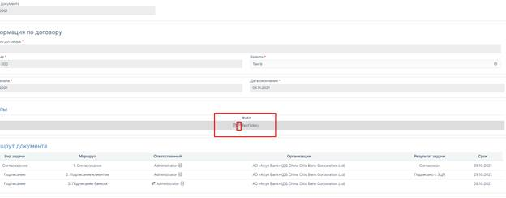
  
 

При нажатии на файл откроется файл в формате PDF с наложенными QR кодами:

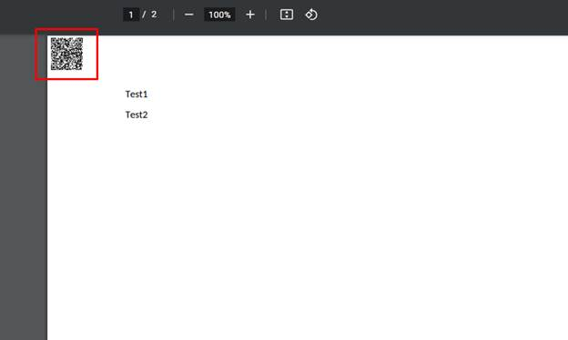
  

Информацией об ЭЦП в подвале каждой странице:

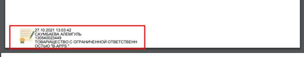

и дополнительной страницей с информацией об ЭЦП:

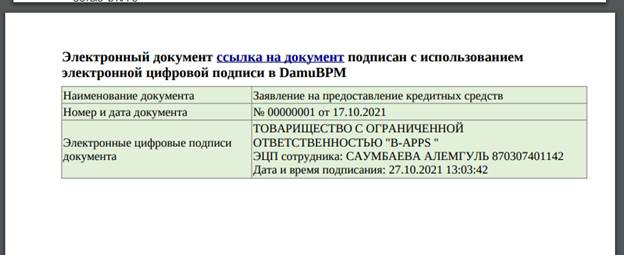

Проверка ЭЦП через сервис ezsigner.kz
-----------------------------------------------

Для проверки юридической значимости ЭЦП во внешнем сервисе ezsigner.kz, разработанным АО «Национальные информационные технологии», под администратором зайдем в Настройки->Файлы:

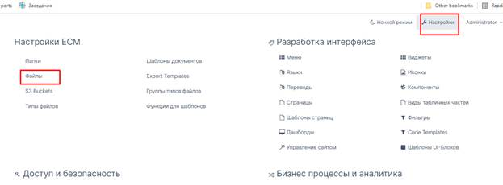

Найдем файл по имени, убедимся, что есть галочка Наличие ЭЦП:

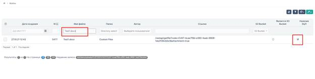

Щелкним на строку с файлом и перейдем к детализации Файла:

В открывшемся файле детализация нажмем перейти в табличной части «Электроннные цифровые подписи»

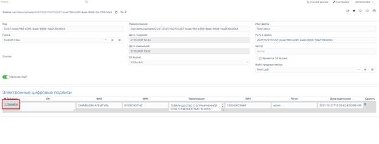

Нажмем на «ЭЦП для ezsigner.kz»

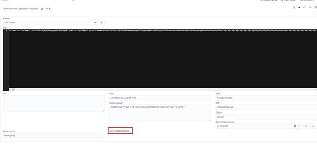

Скачается файл:

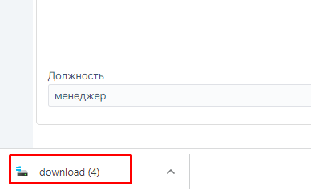

Переходим на сайт ezsigner.kz, нажимаем Проверить документ:

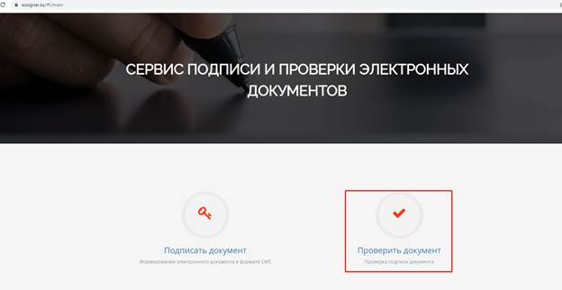

Нажимаем Choose File /Выбрать файл

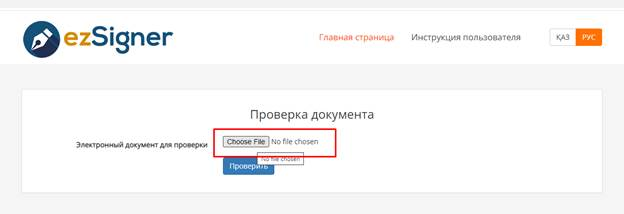

Выбираем файл:

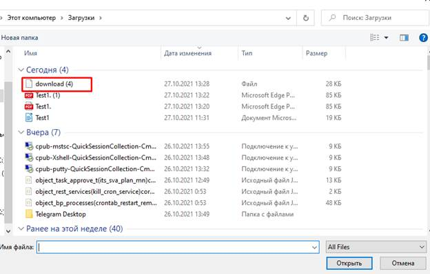

Нажимаем проверить:

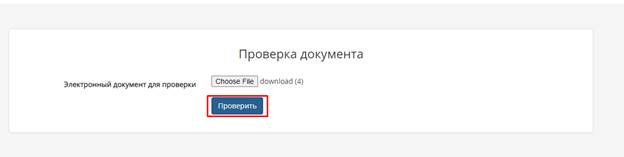

На экране видим информацию об электронном документе. Все проверки ЭЦП прошли успешно:

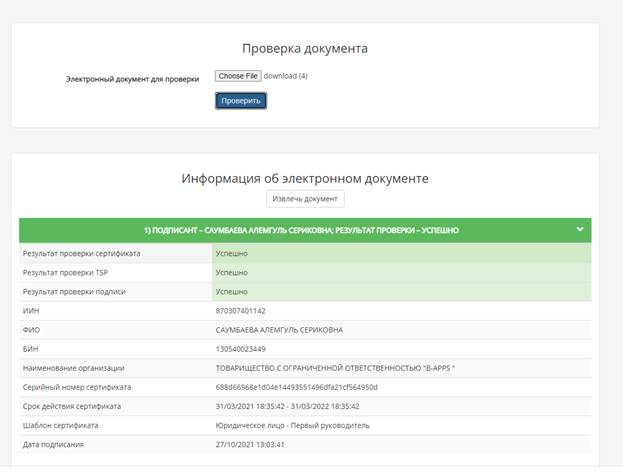

Для извлечения оригинала документа нажмите Извлечь документ:

Скачается файл в формате Base64.

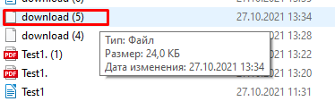

Откройте блокнотом скаченный файл, скопируйте содержимое текста в буфер обмена.

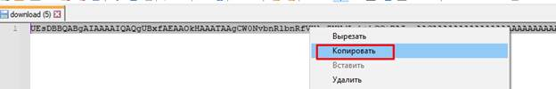

В браузере введите следующую строку:

data:application/octet-stream;base64,СОДЕРЖИМОЕ ИЗ БУФЕРА ОБМЕНА

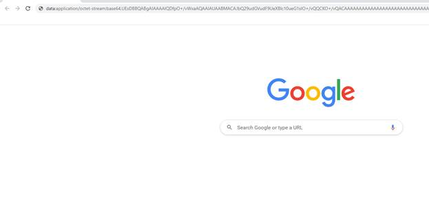
  
И нажмите Enter

Скачается файл, переименуйте расширение файла в .docx.

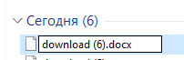

Открываем и видим оригинал документа:

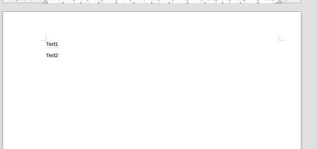