Документы
==================================================================================================

Данный раздел описывает документы и процессы документов

Кредиты
----------------------

Описание документа
______________________________

**Кредиты** (ДБЗ) - записи о просроченных кредитах, получаемые из АБС.

Скриншот экранной формы Кредита (ДБЗ)

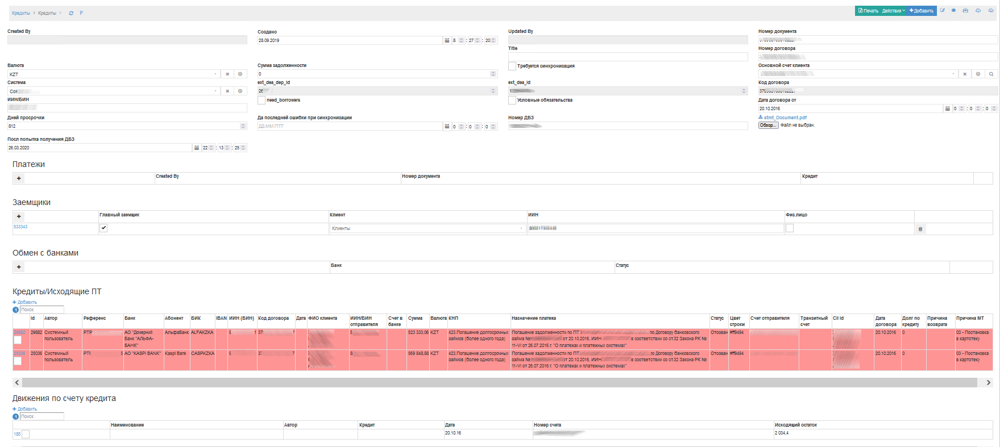

**Поля документа:**

**Автор** - автор документа

**Создано** - дата и время загрузки ДБЗ из АБС

**Номер договора** - номер ДБЗ

**Валюта** - Валюта ДБЗ

**Сумма задолженности** - Сумма задолженности на момент синхронизации из АБС

**Требуется синхронизация** признак, при установке которого произойдет синхронизация записи из АБС

**Основной счет клиента** - счет клиента, который привязан к ДБЗ

**Система** - АБС, к которой относится ДБЗ

**ext_dea_dep_id**, **ext_dea_id** - Идентификаторы ДБЗ из АБС Colvir

**Дней просрочки** - количество дней просрочки

**Файл** - Скан файла ДБЗ в формате PDF, содержащий ДБЗ и выписку по предоставлению кредита.

**Заемщики** - заемщик, созаемщик по ДБЗ

**Исходящие ПТ** исходящие ПТ, сформированные на основе данного ДБЗ

**Движения по счету кредита** Выписка по основному счету в день предоставления кредита. Необходима для добавления выписки в скан PDF ДБЗ

Бизнес-процессы по Кредитам
____________________________________

**k2loan_sync - Синхронизация**

Скриншот схемы BPMN 2.0 k2loan_sync - Синхронизация

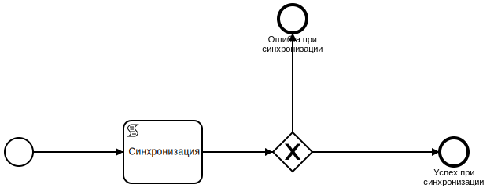

Синхронизирует информацию по ДБЗ из АБС

**k2loan_refuse_0 - Отзыв ПТ по 0-вым долгам**

Скриншот схемы BPMN 2.0 k2loan_refuse_0 - Отзыв ПТ по 0-вым долгам

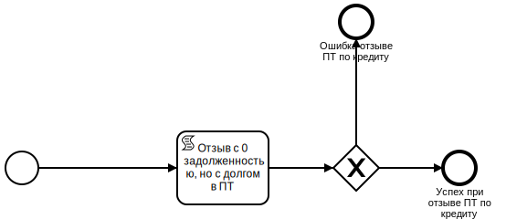

Отзывает платежные требования по ДБЗ, у которых долг = 0

**k2loan_concat_stmt - Склеить выписку к ДБЗ**

Скриншот схемы BPMN 2.0 k2loan_concat_stmt - Склеить выписку к ДБЗ

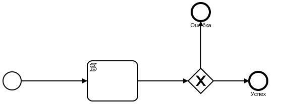

Добавляет в конец PDF ДБЗ выписку

**k2loan_extreq - Выставить исходящее ПТ**

Скриншот схемы BPMN 2.0 k2loan_extreq - Выставить исходящее ПТ

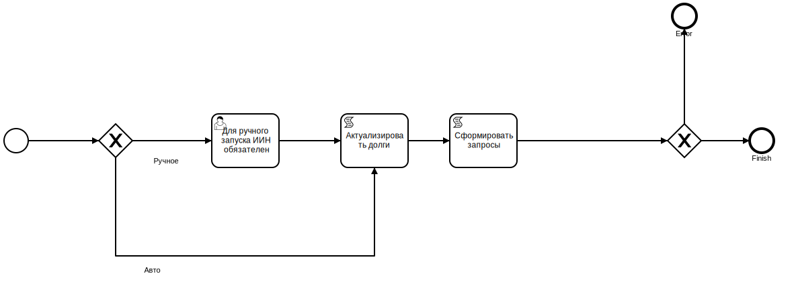

Процесс выставляет исходящее требование по долгу ДБЗ.

Если запустить процесс вручную, введите ИИН

**k2loan_get_agreement - Получить скан ДБЗ**

Скриншот схемы BPMN 2.0 k2loan_get_agreement - Получить скан ДБЗ

Обращается в электронный архив Банка и запрашивает скан ДБЗ

**k2loan_create_extreq_manual - Создать исх пт. на бум. носителе**

Скриншот схемы BPMN 2.0 k2loan_create_extreq_manual - Создать исх пт. на бум. носителе

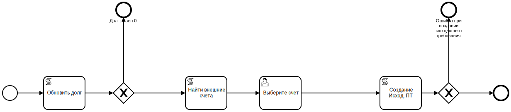

Формирует PDF вариант исходящего требования

**k2loan_create_extreq_manual - Создать исх пт. на бум. носителе**

Скриншот схемы BPMN 2.0 k2loan_create_extreq_manual - Создать исх пт. на бум. носителе

Формирует PDF вариант исходящего требования

**k2loan_compress_dbz - Сжатие дбз файлов**

Скриншот схемы BPMN 2.0 k2loan_compress_dbz - Сжатие дбз файлов

Сжатие происходит по следующему алгоритму:

.. code-block:: lua

	errText,errNum = Command("gs","-sDEVICE=pdfwrite", "-dCompatibilityLevel=1.5", "-dPDFSETTINGS=/screen", "-dNOPAUSE", "-dQUIET", "-dBATCH", "-sOutputFile="..pdfTmpFile, renamedfile)

Сжимает PDF файл.

Список исключений
----------------------

Описание документа
______________________________

Документ содержит два поля:

**Кредит**

**Признак исключения** - Да / Нет

Бизнес-процессы по "Список исключений"

**k2loan_exclude_on - Включить**

Скриншот схемы BPMN 2.0 k2loan_exclude_on - Включить

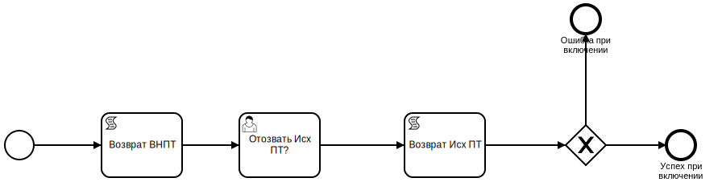

Включает в список исключений выбранный ДБЗ

**k2loan_exclude_off - Выключить**

Скриншот схемы BPMN 2.0 k2loan_exclude_off - Выключить

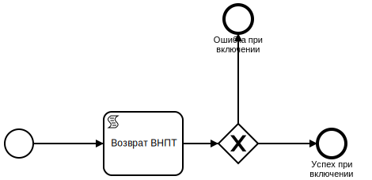

Отменяет ранее включение ДБЗ в список исключений

Требования
----------------------

Описание документа
______________________________

..
	Сформирована через БП sphinx_sql_to_table
	select title "операция",priority "приоритет" from k2opertype where entity_id=1280
    and priority<>0
    order by 1

.. list-table:: Виды операций для документа "Требования"
   :header-rows: 1

   * - операция
     - приоритет
   * - ВнПТ
     - 5000
   * - ИР1
     - 1000
   * - ИР2
     - 2000
   * - ИР3
     - 3000
   * - ИР3 НК
     - 3000
   * - ИР4
     - 4000
   * - ОПВ/ОППВ
     - 2000
   * - Платежный ордер/ Комиссия Банка
     - 5000
   * - Платежный ордер/ Комиссия Банка(Без контроля ПМ )
     - 5000
   * - ПТ
     - 5000

..
	Сформирована через БП sphinx_sql_to_table
	select s.title as "наименование_статуса", s.can_edit "возможность_коррекции",s.enable_refuse "возможность_отзыва",  krr.code "код_возврата_mt"from k2req_stat s
    join k2return_reason krr on krr.id = s.return_mt_reason_id

.. list-table:: Статусы требований
   :header-rows: 1

   * - наименование_статуса
     - возможность_коррекции
     - возможность_отзыва
     - код_возврата_mt
   * - Введен
     - 1
     - 0
     - 05
   * - Исполнено
     - 0
     - 0
     - 07
   * - Принято к исполнению
     - 0
     - 0
     - 08
   * - Принята картотека
     - 0
     - 1
     - 08
   * - Возвращено банком
     - 0
     - 0
     - 06
   * - Отозвано
     - 0
     - 0
     - 06
   * - не принято/неправильные реквизиты
     - 0
     - 0
     - 05
   * - На доработке
     - 1
     - 0
     - 05
   * - Приостановлена пользователем
     - 0
     - 1
     - 08
   * - На ручной обработке
     - 1
     - 0
     - 05
   * - Импортирован
     - 0
     - 0
     - 05

Скриншот экранной формы Требования

.. image:: img/pt.png
  :width: 100%
  :alt: Требование

При создании документу присваивается приоритет исходя из вида операций. Приоритет может быть от 0 до 5000

Каждый документ содержит **Код Группы** для учета долга по требованию

**Референс** является обязательным и уникальным полем

**Абонент** является обязательным полем для требований по электронным каналам

**Система** является обязательным полем. Система определяется по системе (АБС) основного счету, по которому выставилось требование

**Дата приема** заполняется вручную, а в электронных каналах автоматически

**Дата загрузки** заполняется автоматически для электронных каналах

**Номер документа** заполняется из сообщения MT или XML(АИС ОИП)

**Дата документа** заполняется из сообщения MT или XML(АИС ОИП)

**Дата документа** заполняется из сообщения MT или XML(АИС ОИП)

**ИИН клиента** одтягивается из  MT или XML(АИС ОИП). При ручном вводе заполняется вручную.

**Наименование счета** подтягивается из  MT или XML(АИС ОИП). При ручном вводе подтягивается автоматически из справочника Счета k2acc.title

Поле **КОД** подтягивается автоматически из карточки клиента по полю k2acc.residfl + k2acc.sect_id

**Номер договора ДБЗ** и **Дата ДБЗ** подтягивается из MT файла по ПТ БВУ.

**Назначение платежа** заполняется из  MT или XML(АИС ОИП) по электронным каналам либо вводится вручную

**Сумма требования** заполняется из  MT или XML(АИС ОИП) по электронным каналам либо вводится вручную

**Валюта** заполняется из  MT или XML(АИС ОИП) по электронным каналам либо вводится вручную

**КНП** заполняется из  MT или XML(АИС ОИП) по электронным каналам либо вводится вручную

**Руководитель** и **Бухгалтер заполняется** из  MT или XML(АИС ОИП) по электронным каналам либо подтягивается автоматически из справочника Банки (k2bank).

**Счета по требованию** заполняются автоматически, если средств на основном счете требования недостаточно для исполнения требования

**Платежи по требованию** формируются если средств на счете достаточно

Если по требованию сработали проверки, то добавляется **чек лист** с описанием ошибки

Бизнес-процессы по требованию
____________________________________

**k2reqs_post - Регистрация требования**

Скриншот схемы BPMN 2.0 k2reqs_post - Регистрация требования

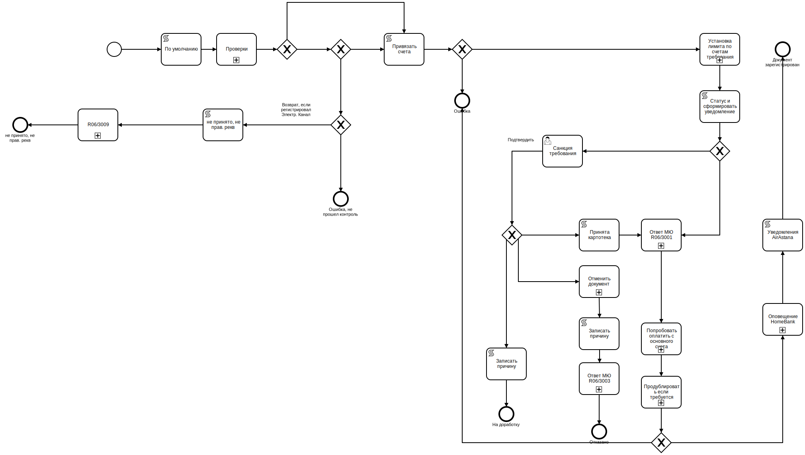

**k2req_refuse - Отозвать требование**

Скриншот схемы BPMN 2.0 k2req_refuse - Отозвать требование

.. image:: svg/k2req_refuse.svg
  :width: 100%
  :alt: Требование

**k2req_return - Возврат требования**

Скриншот схемы BPMN 2.0 k2req_return - Возврат требования

.. image:: svg/k2req_return.svg
  :width: 100%
  :alt: Требование

**k2req_suspend - Приостановить требование**

Скриншот схемы BPMN 2.0 k2req_suspend - Приостановить требование

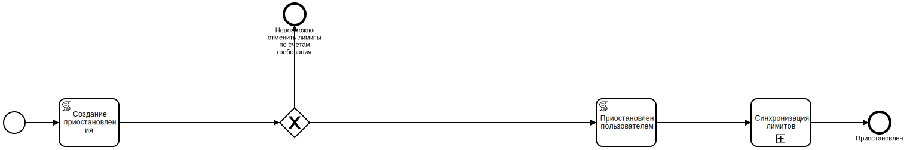

**k2req_set_priority - Установить приоритет требования**

Скриншот схемы BPMN 2.0 k2req_set_priority - Установить приоритет требования

.. image:: svg/k2req_set_priority.svg
  :width: 100%
  :alt: Установить приоритет требования

**k2req_check - Проверка требования**

Скриншот схемы BPMN 2.0 k2req_check - Проверка требования

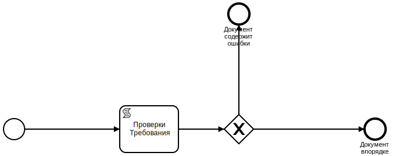

**k2req_refuse_1year - Отозвать по истечению года**

Скриншот схемы BPMN 2.0 k2req_refuse_1year - Отозвать по истечению года

Исходящие требования
----------------------

Описание документа Исходящие требования
____________________________________________________________

..
	Сформирована через БП sphinx_sql_to_table
	select
    s.title "наименование",
    s.actual "актуальная",
    s.can_edit "возможно_редактировать",
    s.can_refuse "можно_отзывать"
    from k2extreq_stat s

.. list-table:: Описание статусов исходящих требований
   :header-rows: 1

   * - наименование
     - актуальная
     - возможно_редактировать
     - можно_отзывать
   * - Отправлен
     - 1
     - 0
     - 0
   * - Зарегистрирован
     - 1
     - 0
     - 0
   * - Отозван
     - 0
     - 0
     - 0
   * - Возвращен
     - 0
     - 0
     - 0
   * - Отказан
     - 0
     - 0
     - 0
   * - Принята банком
     - 1
     - 0
     - 0
   * - Принята в картотеку банка
     - 1
     - 0
     - 1
   * - Сформирован на бумажном носителе
     - 1
     - 0
     - 1
   * - Введен
     - 0
     - 1
     - 0

Скриншот экранной формы Исходящие требования

.. image:: img/extreq.png
  :width: 100%
  :alt: Исходящие требования

При создании документу присваивается **автор**, **дата создания**

**Референс** формируется автоматически по формуле PTP<0000><НомерПоПорядку>

Поле **Банк** является обязательным полем

Поле **Абонент** является обязательным полем для электронных каналов

Поле **БИК** заполняется автоматически по полю **Банк**

Поле **ИИН(БИН)** заполняется автоматически по полю **Банк**

Поле **Кредит** заполняется автоматически при автоматическому выставлении Исходящего ПТ

Поле **Код Договора** и **Номер договора**, **ФИО Клиента**, **ИИН/БИН отправителя**, **Валюта** заполняются автоматически из полей документа - Кредит

Поле **Сумма**  заполняются автоматически из поле долг Кредита

Поле **Причина MT**  - текущий MT статус документа, получаемый в ответе по электронному каналу

Поле **Долг по кредиту**  заполняется по инфомарации по кредиту

Табличная часть "MT файлы" заполняются по мере электронного обмена по документу

Табличная часть "Отзывы" заполняется при отзыве документа

Бизнес-процессы по документу Исходящие требования
________________________________________________________________________

**k2extreq_do - Зарегистрировать**

Регистрирует исходящее требование, устанавливает референс.

Скриншот схемы BPMN 2.0 k2extreq_do - Зарегистрировать

**k2extreq_send - Отправить ПТ электронно**

Отправляет исходящее требование по электронному каналу.

Скриншот схемы BPMN 2.0 k2extreq_send - Отправить ПТ электронно

.. image:: svg/k2extreq_send.svg
  :width: 100%
  :alt: Отправить ПТ электронно

Отправляется MT следующего формата:

.. code-block:: lua

	template_bvu = "{4:\r\n"..
	":20:{{.code}}\r\n"..
	":32A:{{.dtdt}}{{.cur_code}}{{.amount_sep}}\r\n"..
	":50:/C/{{.tr_acc_code}}\r\n"..
	"/IDN/{{.own_bank_bin}}\r\n"..
	"/NAME/{{.own_bank_mt_title}}\r\n"..
	"/CHIEF/{{.head}}\r\n"..
	"/MAINBK/{{.accountant}}\r\n"..
	"/IRS/1\r\n"..
	"/SECO/4\r\n"..
	":52B:{{.own_bank_code}}\r\n"..
	":57B:{{.bank_code}}\r\n"..
	":59:{{.extacc_code}}\r\n"..
	"/NAME/{{.cli_title}}\r\n"..
	"/IDN/{{.cli_code}}\r\n"..
	"/IRS/{{.irs}}\r\n"..
	"/SECO/{{.seco}}\r\n"..
	":70:/NUM/{{.id}}\r\n"..
	"/DATE/{{.dtdt}}\r\n"..
	"/SEND/07\r\n"..
	"/DBZ/{{.loan_docnum}}/{{.loan_doc_at_fmt}}/01\r\n"..
	"/VO/02\r\n"..
	"/KNP/{{.knp_code}}\r\n"..
	"/BCLASS/\r\n"..
	"/PRT/01\r\n"..
	"/ASSIGN/{{.purpose}}\r\n"..
	"-}"

Отзывы исходящих требований
-------------------------------

Описание документа Отзывы исходящих требований
________________________________________________________________________

..
	Сформирована через БП sphinx_sql_to_table
	select title "наименование_статуса" from k2extreq_refuse_stat kers

.. list-table:: Статусы отзывов исходящих требований
   :header-rows: 1

   * - наименование_статуса
   * - Введен
   * - Зарегистрирован
   * - Отправлен
   * - Отзыв подтвержден
   * - Возвращен
   * - Отказан
   * - Ошибка при отзыве

Скриншот экранной формы Исходящие требования

.. image:: img/extreq_refuse.png
  :width: 100%
  :alt: Отзывы исходящих требований

Бизнес-процессы по документу Отзывы исходящих требований
________________________________________________________________________

**
k2extreq_refuse_do - Исполнить отзыв**

Отзывает исходящее требование. Формирует MT-файл следующего формата:

.. code-block:: lua

	data =
	"{{.header}}\r\n"..
	"{4:\r\n"..
	":20:{{.refer}}\r\n"..
	":12:400\r\n"..
	":77E:FORMS/OP1/{{.refuse_date}}/{{.id}}/Отзыв птп\r\n"..
	"/BANK/{{.bank_code}}\r\n"..
	"/PLAT/{{.cli_code}}/{{.extacc_code}}/{{.cli_title}}\r\n"..
	"/REFDOC/{{.cur_code}}/{{StrReplace .amount \".\" \",\" -1 }}/{{.extreq_id}}/{{.extreq_doc_at}}/{{.extreq_code}}\r\n"..
	"/ASSIGN/{{.purpose}}\r\n"..
	"/REASON/{{.return_reason_code}}\r\n"..
	"-}\r\n"

Скриншот схемы BPMN 2.0 k2extreq_refuse_do - Исполнить отзыв

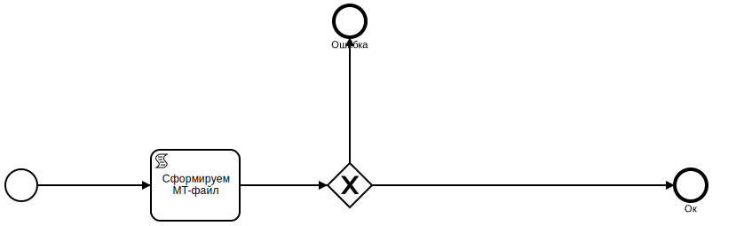

**k2extreq_refuse_if_zero - Отозвать, если, долг 0**

Отзывает исходящее требование, если долг по кредиту равен нулю. Запускается подпроцесс k2extreq_refuse_do Исполнить отзыв.

Скриншот схемы BPMN 2.0 k2extreq_refuse_if_zero - Отозвать, если, долг 0

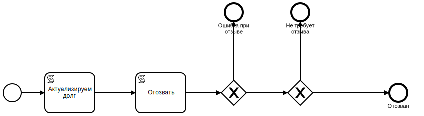

**k2extreq_refuse_manual - Сформировать отзыв**

Отзывает исходящее требование вручную пользователем. Вводится причина отзыва в диалоговом окне.

..
	Сформирована через БП sphinx_sql_to_table
	select code "код", title "причина" from k2return_reason

.. list-table:: Причины отзывов
   :header-rows: 1

   * - код
     - причина
   * - 88
     - В связи с решением суда
   * - 12
     - В связи с ликвидацией/банкротством
   * - 01
     - Закрытие счета
   * - 02
     - Погашение другим инкассовым распоряжением
   * - 03
     - Неверные реквизиты отправителя денег
   * - 04
     - Несоответствие ЕКНП
   * - 05
     - Несоответствие КБК
   * - 06
     - погашение
   * - 07
     - другая причина
   * - 08
     - Несоответствие КОд
   * - 09
     - Несоответствие КБе
   * - 95
     - Неверный ключ счета банка бенефициара
   * - 96
     - Введено ошибочно дважды
   * - 97
     - Возвращено банком бенефициара
   * - 98
     - Отказ в оплате, недостаточно средств на карте
   * - 99
     - По истечению срока
   * - 11
     - Возврат по спецсчету
   * - 10
     - Возврат электронного ИР на основании отзыва поступившего на бумажном носителе
   * - 01_1
     - Закрытие счета бенефициара (получателя)

Запускается подпроцесс k2extreq_refuse_do Исполнить отзыв.

Скриншот схемы BPMN 2.0 k2extreq_refuse_manual - Сформировать отзыв

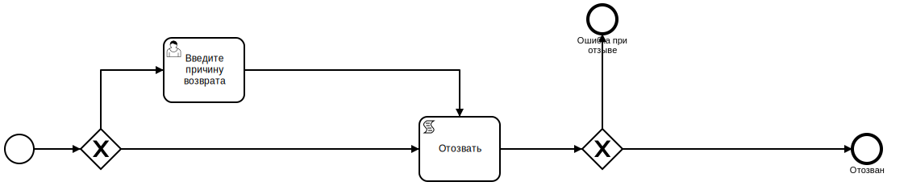

Входящие запросы
---------------------------

Описание документа Входящие запросы
________________________________________________________________________

Входящие запросы представляют сущность , которая сформировалась на основе полученного входящего 998 файла либо информационного XML запроса (АИС ОИП)

..
	Сформирована через БП sphinx_sql_to_table
	select i.code "код", i.title "причина",p.code as "код_процесса",p.title as "процесс" from k2inforeq_type i
    join bp_processes p on p.id=i.bp_process_id
    order by 1

.. list-table:: Виды инфомационных запросов и процессы, которые обрабатывают их
   :header-rows: 1

   * - код
     - причина
     - код_процесса
     - процесс
   * - A1C
     - A1C
     - k2inforeq_do_a1c
     - Обработка уведомления об открытии счета
   * - AC
     - РПРО AC
     - k2inforeq_do_rpro
     - Исполнить РПРО
   * - ACN
     - РПРО ACN налог
     - k2inforeq_do_rpro
     - Исполнить РПРО
   * - ACP
     - РПРО ACP ОПВ
     - k2inforeq_do_rpro
     - Исполнить РПРО
   * - ACR
     - Отзыв РПРО
     - k2inforeq_do_rpro_refuse
     - Отзыв РПРО по файлу
   * - ACR_MJ
     - Отзыв Ареста МЮ
     - k2inforeq_do_acr_mj
     - Отозвать Арест МЮ
   * - ASD
     - РПРО ASD CO
     - k2inforeq_do_rpro
     - Исполнить РПРО
   * - ASD_MJ
     - Арест МЮ
     - k2inforeq_do_rpro
     - Исполнить РПРО
   * - EAC
     - Ответ на запрос о наличии счетов
     - k2inforeq_do_eac
     - Обработка ответа на запрос о наличии счета
   * - EAR
     - Запрос о наличии счетов
     - k2inforeq_do_ear
     - Запрос о наличии счетов
   * - EAR_MJ
     - Запрос о налич сч МЮ
     - k2inforeq_do_ear_mj
     - Запрос о наличии счетов МЮ
   * - EDR
     - Запрос о движении по счету
     - k2inforeq_do_edr
     - Запрос о движении по счету
   * - OP1
     - Отзыв ПТП
     - k2inforeq_do_op1
     - Обработка запроса: Отзыв ПТП
   * - OR1
     - Отзыв ИР
     - k2inforeq_do_op1
     - Обработка запроса: Отзыв ПТП
   * - OR1_MJ
     - Отзыв ИР МЮ
     - k2inforeq_do_op1
     - Обработка запроса: Отзыв ПТП
   * - PC1
     - Подтверждение о принятии птп
     - k2inforeq_do_pc1_3
     - Обработка подтверждения ПТ
   * - PC2
     - Подтверждение о принятии отзыва птп
     - k2inforeq_do_pc2
     - Обработка возврата требования
   * - PC3
     - Помещение банком птп картотеку
     - k2inforeq_do_pc1_3
     - Обработка подтверждения ПТ
   * - PC6
     - PC6
     - k2inforeq_do_pc6
     - Ответ на реестр к запросу
   * - PR1
     - Возврат ПТ
     - k2inforeq_do_pr1
     - Обработка отзыва ПТ
   * - RZAP
     - RZAP
     - k2inforeq_do_rzap
     - Обработать RZAP
   * - SR1
     - Стат. реестр
     - k2inforeq_do_sr1
     - Стат реестр

Скриншот экранной формы "Входящие запросы"

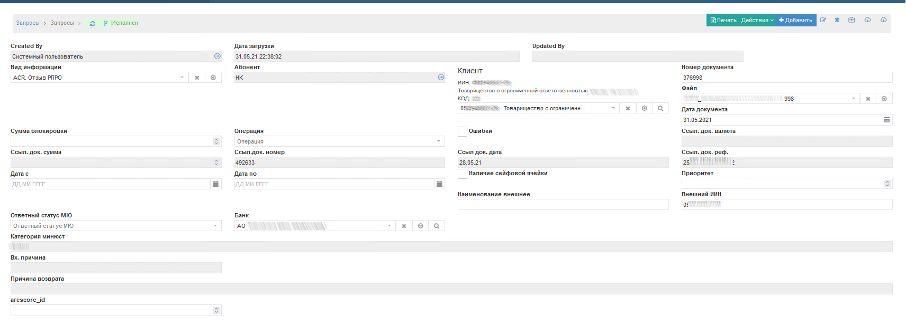

Бизнес-процессы по документу Входящие запросы
________________________________________________________________________

**k2inforeq_check - Проверки по запросу**

Запускает проверки по Входящему запросу

Скриншот схемы BPMN 2.0 k2inforeq_check - Проверки по запросу

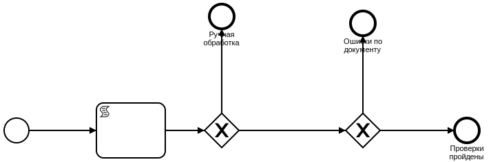

**k2inforeqs_do - Принять**

Принять входящий запрос. Будет запущен запрос исходя из видов информационных запросов

Скриншот схемы BPMN 2.0 k2inforeqs_do - Принять

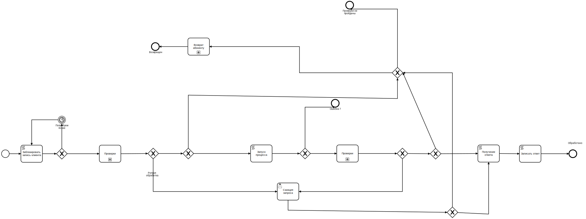

Запрос о наличии счетов
--------------------------

Описание документа
______________________________

**Запрос о наличии счетов** - Электронные запросы или запросы на бумажных носителях о наличии счетов по клиентам.

Скриншот экранной формы Запрос о наличии счетов

.. image:: img/extaccreq.png
  :width: 100%
  :alt: Запрос о наличии счетов
  
**Банк** - банк, в который отправляется запрос о наличии счетов клиентов

**Абонент** - заполняется для отправки по электронным каналам

**Ответ по RZAP (PC6)** - ответ, полученный по запросу о наличии счетов

В табличной части **Клиенты** указываюся клиенты, по которым формируется запрос о наличии счетов

Бизнес-процессы
_______________________________

**k2extaccreq_rzap -  Сформировать RZAP-файл**

Скриншот схемы BPMN 2.0 k2extaccreq_rzap - Сформировать RZAP-файл

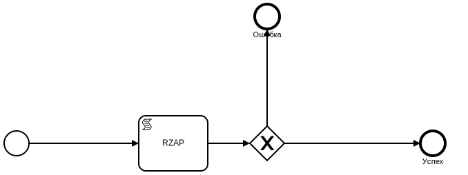
  
Формирует MT следующего формата:

.. code-block:: lua

	template_bvu = "{4:\r\n"..
	":20:{{.code}}\r\n"..
	":12:400\r\n"..
	":77E:FORMS/RZAP/{{.dtdt}}/Реестр к запросу\r\n"..
	"/SENDER/{{.own_bank_code}}\r\n"..
	"/BANK/{{.bank_code}}\r\n"..
	"{{ range $key, $value := .dbz }}//07/{{$value.cli_title}}/{{$value.cli_iin}}/{{$value.loan_code}}/{{$value.loan_doc_at_fmt}}\r\n{{end}}"..
	"/TOTAL/{{.dbz_total}}\r\n"..
	"-}"
  

**k2extaccreqdtl_send_dbz - Отправляет Скан ДБЗ в БВУ**

Скриншот схемы BPMN 2.0 k2extaccreqdtl_send_dbz - Отправляет Скан ДБЗ в БВУ

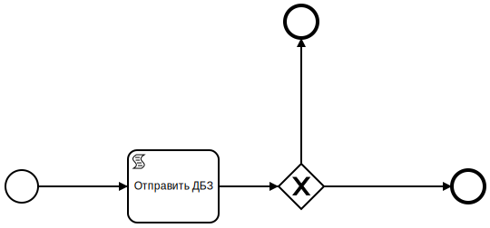
  
Отправка происходит по процессу, который указан в соответствующем Банке.

Например, формат отправки в один из БВУ:

.. code-block:: lua

	local body =[[<soapenv:Body Id="]]..request_uuid..[[">
		  <alf:PtpDbzSendIncomingRequest>
			 <alf:bik>]].. HTMLEscapeString(info.bank_code)..[[</alf:bik>
			 <alf:fileName>]]..HTMLEscapeString(filename)..[[</alf:fileName>
			 <alf:base64Data>]]..Base64Encode(content)..[[</alf:base64Data>
			 <alf:iin>]].. HTMLEscapeString(info.ext_cli_iin)..[[</alf:iin>
			 <alf:agrementNumber>]].. HTMLEscapeString(info.dbz_num)..[[</alf:agrementNumber>
			 <alf:agrementDate>]].. HTMLEscapeString(info.doc_at)..[[</alf:agrementDate>
			 <alf:referenceId>]].. HTMLEscapeString(info.code)..[[</alf:referenceId>
			 <alf:bankCode>]].. HTMLEscapeString(info.abonent_dbz_code)..[[</alf:bankCode>
			 <alf:nameClient>]].. HTMLEscapeString(info.title)..[[</alf:nameClient>
		  </alf:PtpDbzSendIncomingRequest>
	   </soapenv:Body>]]
	   
	local header = array( { ["Content-type"] = "text/xml;charset=UTF-8", ["SoapAction"] = "http://ala.bapps000.kz/Ptp_Dbz_Common_Send_Ws/IPtp_Dbz_Common_Send_Ws2/ptpDbzSendRequest"  } )

	local data = [[<soapenv:Envelope xmlns:soapenv="http://schemas.xmlsoap.org/soap/envelope/"
	xmlns:alf="https://bapps000.kz">
	   <soapenv:Header/>
	]]
	..body..
	[[</soapenv:Envelope>]]
	   
При отправке накладывается ЭЦП.  

**k2extaccreqdtl_send - Отправить MT**

Формирует MT следующего формата:

.. code-block:: lua

	template_bvu = "{4:\r\n"..
	":20:{{.code}}\r\n"..
	":12:400\r\n"..
	":77E:FORMS/EAR/{{.dtdt}}/{{.id}}/Запрос о наличии счетов\r\n"..
	"/BANK/{{.bik}}\r\n"..
	"/TOIDN/{{.bank_bin}}/{{.bank_title}}\r\n"..
	"/PLAT/{{.iin}}/{{.title}}\r\n"..
	"/DATE/{{.sysdt}}\r\n"..
	"-}"

Связанные процессы
_______________________________

**k2loan_extreq  - Выставить исходящее ПТ** - формирует запрос о наличии счетов

**k2inforeq_do_pc6 - Ответ на реестр к запросу**

**k2inforeq_do_eac - Обработка ответа на запрос о наличии счета**

Счета в другом банке
--------------------------

Описание документа
___________________________

Скриншот экранной формы Счета в другом банке

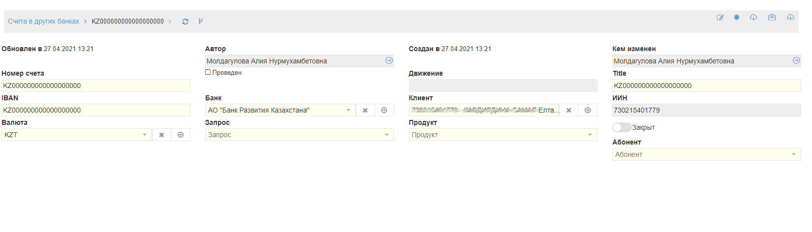
  
**Номер счета** - IBAN счета в другом банке

**Банк** - банк, в котором открыт счет

**Клиент** - клиент, которому принадлежит счет

**Валюта** - валюта счета

**Запрос** - запрос о наличии счета

**Закрыт** - Признак, если счет закрыт
  
Связанные процессы
_______________________________

**k2inforeq_do_eac - Обработка ответа на запрос о наличии счета**

**k2loan_extreq  - Выставить исходящее ПТ** - формирует запрос о наличии счетов

  
  
