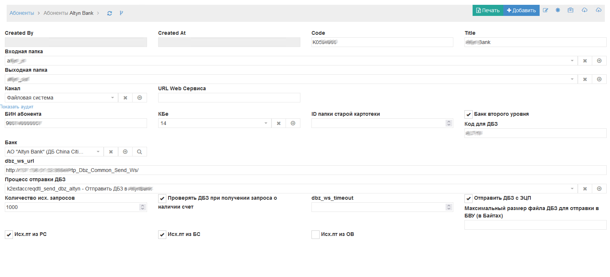
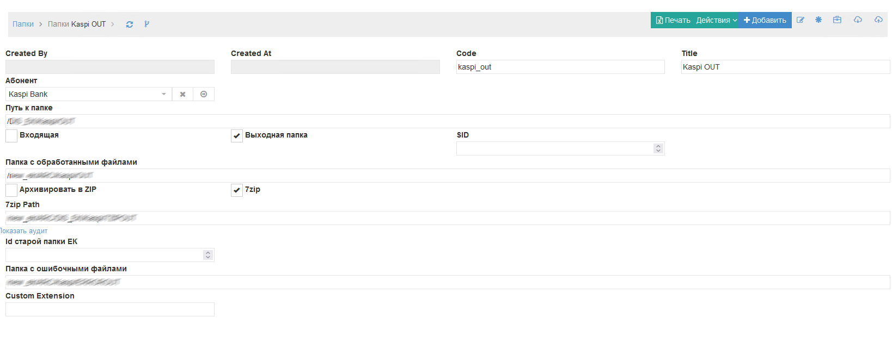
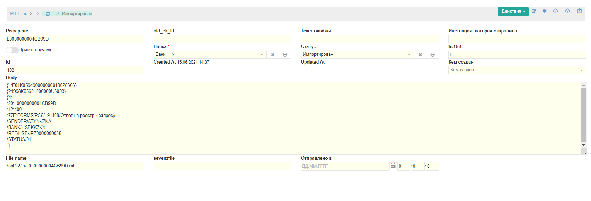

Обмен
==================================================================================================

Данный раздел описывает сущности и процессы по обмену в КО

Абоненты
-------------------------

Справочник абонентов предназначен ведения для электронного обмена между БВУ, НК и АИС ОИП.

Скриншот экранной формы Абоненты

Поле **Code** представляет кодовое обозначение абонента. MT Файлы именуются по коду абонента.

В поле **Выходная папка** указывается папка, в которую будут записаны исходящие файлы.

В поле **Входная папка** указывается папка, Которую читает абонент для приема ПТ и входящих запросов.

В поле **Канал** Указывается Файловая система, DBLink либо Веб сервис.

В поле **Банк** указывается банк, к которму относится абонент.

В поле **dbz_ws_url** содержится URL Endpoint, который нужно вызывать при передаче Скана ДБЗ.

В поле **Процесс отправки ДБЗ** указывается бизнес-процесс отправки ДБЗ.

**Количество исх. запросов**  - макс. количество исх. запросов, отправляемых в день.

**Проверять ДБЗ при получении запроса о наличии счет**, проверять ли наличие Скана ДБЗ, если поступил запрос о наличии счета.

**Отправить ДБЗ с ЭЦП** - Накладывать ли ЭЦП НУЦ РК на ДБЗ при отправки

Папки
-------------------------

Справочник папок необходим для логического ведения директорий в КО и связывания их с Абонентами и Mt файлами, ведения настроек и порядка обработки.

Скриншот экранной формы Папки

  
Поле **Абонент** означает к какому абоненту привязана папка

**Путь к папке**, папка, которая будет читаться или куда будет записана MT.

**Входящая** - означает, что эта папка будет считываться системой КО

**Выходная папка** - означает, что в эту папку будет производиться запись

**Папка с обработанными файлами** - Файлы, которые успешно обработались и папки **Путь к папке**, будут перемещены в эту папку.

**Архивировать в ZIP**, файлы, которые будут сюда помещены, будут предварительно сжаты в формат ZIP.

**7zip**, файлы, которые будут сюда помещены, будут предварительно сжаты в формат 7zip.

**7zip Path** - временная папка, куда будут складываться файлы перед запаковкой в 7zip

**Папка с ошибочными файлами** - в случае приема ошибочных файлов, файлы будут перемещаться в эту папку

**Custom Extension** - Расширение файлов, которые будут помещены в эту папку. Опциональный параметр.

MT файлы
-------------------------

Справочник папок необходим для ведения записанных и прочитанных файлов.

Скриншот экранной формы Mt файлы

  
**Референс** - Уникальный Референс Mt- файла. Обычно - это 20-ое поле формата MT.

**Папка** -  Папка, в которой находится Mt файл.

**Body** - Содержимое MT файла.

**File name** -  полный путь к файлу.

**Sevenzfile** -  Имя архивного файла, из которого получился данный файл

**Отправлено в** -  Дата и время отправки файла.

Каналы
-------------------------

Допустимые каналы интеграции:

1. Файловая система

2. DBLink 

3. Веб сервис

Статусы обработки Mt файлов
--------------------------------------------------

..   
	Сформирована через БП sphinx_sql_to_table
	select title from k2mtfile_stat

.. list-table:: Статусы обработки Mt файлов
   :header-rows: 1

   * - title
   * - Импортирован
   * - Ошибка
   * - В старой картотеке
   * - Ошибка при выгрузке в старую ЕК
   * - Отправлен
   * - Готов к отправке
   * - Отправка
   * - sent7z
   * - need_manual

