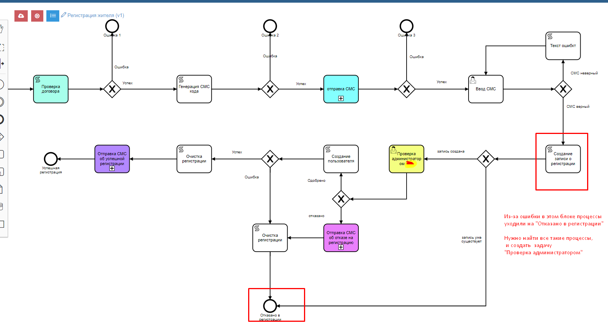

Восстановить процесс. Вручную создать задачу на уже завершенном процессе
==================================================================================================

Из-за ошибки в блоке процессы уходили на "отказано в регистрации". Нужно найти все такие процессы и создать задачу "Проверка администратором" и назначить определенным пользователям.

  
  
Ручное создание задачи:

.. code-block:: sql

	insert into bp_tasks (point_id,code,instance_id,is_open,sys$uuid)
	select 2636,concat('2021-04-13-',i.iin), i.id$, 1, uuid_v4() from `i$ksk_citizen_register_v1` i
	join bp_instances i2 on i2.id=i.id$
	where i.iin in ( select code from ksk_citizen_reg_check where code not in (select coalesce(login,'') from users) 
	and code<>'850618302518'
	) 
	and last_error='Код введен неверно' and i2.finish_point_id =2633;
	
Пометим инстанцию процесса как открытый:

.. code-block:: sql

	update bp_instances set is_finished  = 0, finish_point_id =null where id in 
	(
	select instance_id from bp_tasks where code like '2021-04-13%' and is_open =1
	)
	
Назначим на определенные роли

.. code-block:: sql

	insert into bp_task_actors (task_id,user_id) 
	(
	select t.id,ur.user_id from bp_tasks t 
	join user_roles ur on ur.role_id =101
	where code like '2021-04-13%' and t.is_open =1
	)