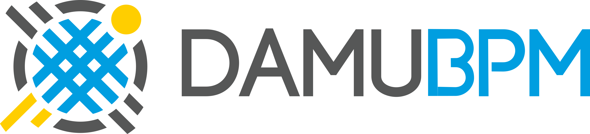

.. DamuBPM documentation master file, created by
   sphinx-quickstart on Sun Feb  7 15:23:05 2021.
   You can adapt this file completely to your liking, but it should at least
   contain the root `toctree` directive.

Добро пожаловать в документацию DamuBPM!
======================================================================

.. toctree::
   :maxdepth: 2
   :caption: Содержание:

Оглавление
====================================

* :ref:`genindex`
* :ref:`search`

Содержание
----------------

.. toctree::
   :maxdepth: 1
   :glob:

   features/index
   install/index
   faq/index
   api/index
   restapi/index
   marketplace/index
   k2/index
   3party/index

О платформе
====================================

DamuBPM - это BPMS платформа с Low code языком программирования позволяющая наименьшими ресурсами и минимумом привлекая разработчиков,

автоматизировать процессы компании.

Применяя нашу систему наши клиенты уже сэкономили тысячи человеко-часов благодаря автоматизации рутинных операций.

Их сотрудники больше не вязнут в документах, а эффективно контролируют и управляют процессами.

Платформа DamuBPM, разработана компанией B-APPS в 2017 году.

Основные задачи платформы:
--------------------------------
1. Разрабатывать корпоративные решения в кратчайшие сроки
2. Прозрачность разрабатываемых бизнес-процессов (BPMN 2.0)
3. Отказоустойчивость и высокие нагрузки, быстрый отклик
4. Автогенерация сущностей, экранных форм, генератор отчетов, выходных файлов
5. Автоматическое покрытие автотестами, unit тестами
6. Разработка в браузере(Без установки среды разработки).
7. Разработка без перезапуска приложения (скриптование на Lua).
8. Разрабатывать сложные интеграционные решения с использованием API

.. toctree::
   dev/reqdev
   dev/index

