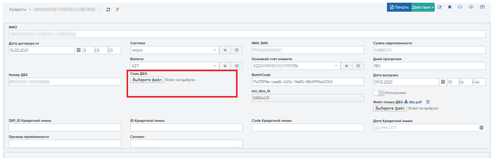
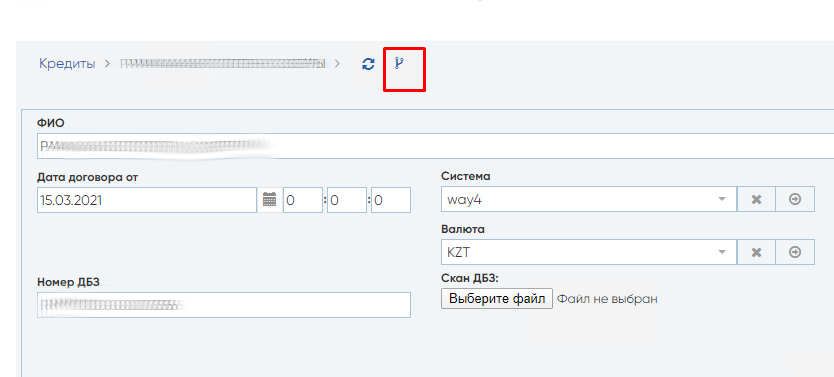
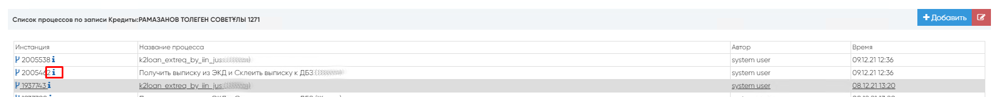
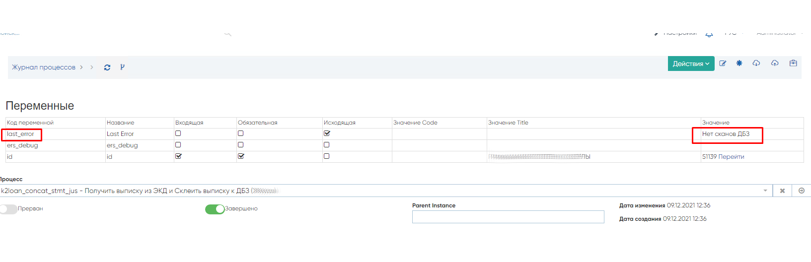
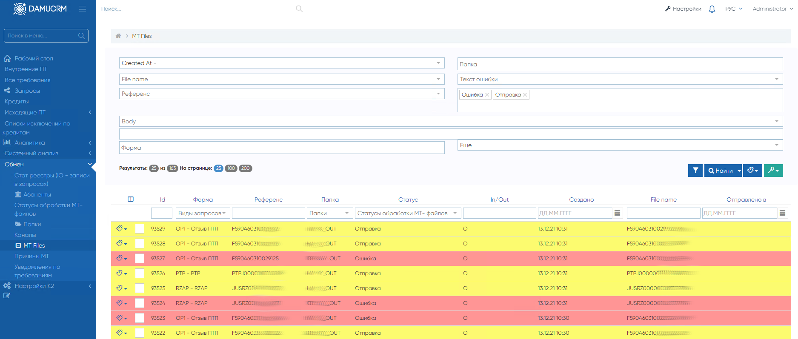

Поиск и устранение ошибок
==================================================================================================

.. _k2loan_empty_dbz:

Поиск причины не выгрузки скана ДБЗ из ЕКО
------------------------------------------------------------------

Открываем кредит, по которому нет файла Скана ДБЗ:

Скриншот экранной формы Кредита с пустым сканом ДБЗ

Нажмем кнопку просмотра действий:

Нажмем кнопку просмотра инстанции в журнале процесса (i) напротив "Получить выписку из ЭКД и Склеить выписку к ДБЗ":

Видим причину ошибки напротив поля last_error:

Нет сканов ДБЗ означает, что сервис ЕКО вернул ответ с 0 элементами поля result, например, result : []

.. _k2mtfile_errors:

Переотправка застрявших МТ-файлов в статусе Ошибка, Отправка
------------------------------------------------------------------------------------------------------------------------------------

В случае, если исходящие MT-файлы зависли в статусе Ошибка или Отправка:

можно переотправить запустив Rest Service k2mtfiles_process_restart_error

либо запустить SQL в базе данных:

.. code-block:: sql

	update k2mtfile set stat_id=3003 where stat_id in (3004,21) and io ='O'

Причины ошибочных отправок файлов:

	1. Нет свободного места на диске с MT-файлами
	2. Не смонтирована папка с MT-файлами
	3. Был перезапущен сервис в момент выгрузки файлов

.. _k2loan_del_extreq:

Ошибка при удалении кредита
-------------------------------

Если при удалении кредита возникает ошибка:

.. code-block:: text

	pq: update or delete on table "k2loan" violates foreign key constraint "k2extreq_loan_id_k2loan_fk" on table "k2extreq"

Необходимо сначала удалить связанные исходящие ПТ по данному кредиту.

Удалить исходящие ПТ по кредиту можно сделать из-под страницы Кредита:

.. image:: img/k2loan_del_extreq.png
  :width: 100%
  :alt: Ошибка

.. _k2loan_set_batchcode:

Массово установить батчкод по всем кредитам
------------------------------------------------------------------

Настройка -> Rest Сервисы

Создать +

Код, например, k2_set_batchcode

Наименование, например, k2_set_batchcode

Модуль: k2

Скрипт:

.. code-block:: lua

	output={}
	output.errText,output.errNum = SqlExec2("update k2loan set batchcode=123")

Сохранить

Нажать кнопку тест и посмотреть результат в поле: Тестовые выходные данные

errText="" и errNum = 0 означает, что все ок

.. _k2resend_dbz:

Массово переотправить ошибочные (неотправленные ранее по техническим причинам) ДБЗ по определенному банку
------------------------------------------------------------------------------------------------------------------------------------

1. Настройка->Rest-Services

2. Находим по коду  resend_dbz

3. Например, нужно перезапустить, процесс **k2extaccreqdtl_send_dbz_alfa1_** , тогда копированием блок кода, который отправляет данные.

Также, папример по Альфе, успешным ответом является наличие слово, **DBZ saved**. поэтому заменяем условие **i3.debug like '%DBZ saved%'**.

По Альфе БП  = **k2extaccreqdtl_send_dbz_alfa1_**, значит заменяем на i$k2extaccreqdtl_send_dbz_alfa1_

.. code-block:: lua

	output = {}

	arr, output.errText, output.errNum = SqlQueryRows([[
		select i2.* from i$k2extaccreqdtl_send_dbz_alfa1_ i2 join bp_instances i on i.id=i2.id$ where (i2.last_error like '%ERR%' or i2.last_error is null)

		and not exists (select 1 from i$k2extaccreqdtl_send_dbz_alfa1_ i3 where i3.id = i2.id and i3.debug like '%DBZ saved%')
		]])
	
	for k,v in pairs (arr) do
		vvars ,instanceId,taskId,errText,errNum = BPMSStartProcess("k2extaccreqdtl_send_dbz",19,{id = v.id})
		Commit()
	end

4. Сохраняем рест сервис, Запускаем через кнопку тест.

