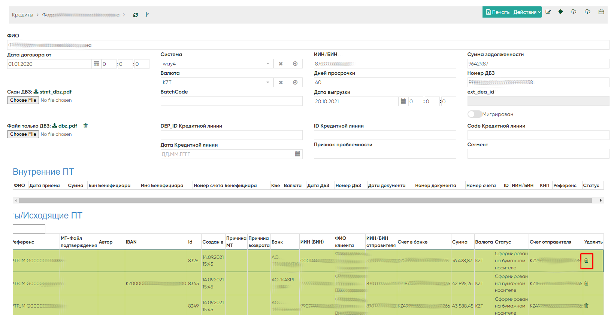

Поиск и устранение ошибок
==================================================================================================

.. _k2loan_empty_dbz:

Поиск причины не выгрузки скана ДБЗ из ЕКО
------------------------------------------------------------------

Открываем кредит, по которому нет файла Скана ДБЗ:

Скриншот экранной формы Кредита с пустым сканом ДБЗ

  

  
Нажмем кнопку просмотра действий:

.. image:: img/k2loan_empty_dbz_01.png
  :width: 100%
  :alt: Кнопка просмотра действий
  

Нажмем кнопку просмотра инстанции в журнале процесса (i) напротив "Получить выписку из ЭКД и Склеить выписку к ДБЗ":

.. image:: img/k2loan_empty_dbz_02.png
  :width: 100%
  :alt: Кнопка просмотра инстанции в журнале процесса
  

Видим причину ошибки напротив поля last_error:

.. image:: img/k2loan_empty_dbz_03.png
  :width: 100%
  :alt: Ошибка
  
Нет сканов ДБЗ означает, что сервис ЕКО вернул ответ с 0 элементами поля result, например, result : []

.. _k2mtfile_errors:

Переотправка застрявших МТ-файлов в статусе Ошибка, Отправка
------------------------------------------------------------------------------------------------------------------------------------

В случае, если исходящие MT-файлы зависли в статусе Ошибка или Отправка:

можно переотправить запустив Rest Service k2mtfiles_process_restart_error

либо запустить SQL в базе данных:

.. code-block:: sql

	update k2mtfile set stat_id=3003 where stat_id in (3004,21) and io ='O'
	
Причины ошибочных отправок файлов:

	1. Нет свободного места на диске с MT-файлами
	2. Не смонтирована папка с MT-файлами
	3. Был перезапущен сервис в момент выгрузки файлов
	
	
.. _k2loan_del_extreq:
	
Ошибка при удалении кредита
-------------------------------

Если при удалении кредита возникает ошибка:

.. code-block:: text

	pq: update or delete on table "k2loan" violates foreign key constraint "k2extreq_loan_id_k2loan_fk" on table "k2extreq"
	
Необходимо сначала удалить связанные исходящие ПТ по данному кредиту.

Удалить исходящие ПТ по кредиту можно сделать из-под страницы Кредита:

  
