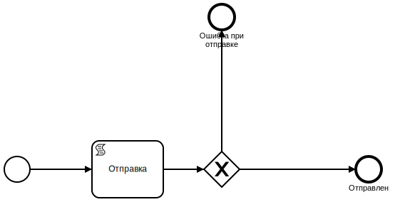

Документы
==================================================================================================

Данный раздел описывает документы и процессы документов

Требования
----------------------

Описание документа
______________________________

..   
	Сформирована через БП sphinx_sql_to_table
	select title "операция",priority "приоритет" from k2opertype where entity_id=1280
    and priority<>0
    order by 1

.. list-table:: Виды операций для документа "Требования"
   :header-rows: 1

   * - операция
     - приоритет
   * - ВнПТ
     - 5000
   * - ИР1
     - 1000
   * - ИР2
     - 2000
   * - ИР3
     - 3000
   * - ИР3 НК
     - 3000
   * - ИР4
     - 4000
   * - ОПВ/ОППВ
     - 2000
   * - Платежный ордер/ Комиссия Банка
     - 5000
   * - Платежный ордер/ Комиссия Банка(Без контроля ПМ )
     - 5000
   * - ПТ
     - 5000
	 
	 
..   
	Сформирована через БП sphinx_sql_to_table
	select s.title as "наименование_статуса", s.can_edit "возможность_коррекции",s.enable_refuse "возможность_отзыва",  krr.code "код_возврата_mt"from k2req_stat s
    join k2return_reason krr on krr.id = s.return_mt_reason_id

.. list-table:: Статусы требований
   :header-rows: 1

   * - наименование_статуса
     - возможность_коррекции
     - возможность_отзыва
     - код_возврата_mt
   * - Введен
     - 1
     - 0
     - 05
   * - Исполнено
     - 0
     - 0
     - 07
   * - Принято к исполнению
     - 0
     - 0
     - 08
   * - Принята картотека
     - 0
     - 1
     - 08
   * - Возвращено банком
     - 0
     - 0
     - 06
   * - Отозвано
     - 0
     - 0
     - 06
   * - не принято/неправильные реквизиты
     - 0
     - 0
     - 05
   * - На доработке
     - 1
     - 0
     - 05
   * - Приостановлена пользователем
     - 0
     - 1
     - 08
   * - На ручной обработке
     - 1
     - 0
     - 05
   * - Импортирован
     - 0
     - 0
     - 05
	 
Скриншот экранной формы Требования

.. image:: img/pt.png
  :width: 100%
  :alt: Требование

При создании документу присваивается приоритет исходя из вида операций. Приоритет может быть от 0 до 5000

Каждый документ содержит **Код Группы** для учета долга по требованию

**Референс** является обязательным и уникальным полем

**Абонент** является обязательным полем для требований по электронным каналам

**Система** является обязательным полем. Система определяется по системе (АБС) основного счету, по которому выставилось требование

**Дата приема** заполняется вручную, а в электронных каналах автоматически

**Дата загрузки** заполняется автоматически для электронных каналах

**Номер документа** заполняется из сообщения MT или XML(АИС ОИП)

**Дата документа** заполняется из сообщения MT или XML(АИС ОИП)

**Дата документа** заполняется из сообщения MT или XML(АИС ОИП)

**ИИН клиента** одтягивается из  MT или XML(АИС ОИП). При ручном вводе заполняется вручную.

**Наименование счета** подтягивается из  MT или XML(АИС ОИП). При ручном вводе подтягивается автоматически из справочника Счета k2acc.title

Поле **КОД** подтягивается автоматически из карточки клиента по полю k2acc.residfl + k2acc.sect_id

**Номер договора ДБЗ** и **Дата ДБЗ** подтягивается из MT файла по ПТ БВУ.

**Назначение платежа** заполняется из  MT или XML(АИС ОИП) по электронным каналам либо вводится вручную

**Сумма требования** заполняется из  MT или XML(АИС ОИП) по электронным каналам либо вводится вручную

**Валюта** заполняется из  MT или XML(АИС ОИП) по электронным каналам либо вводится вручную

**КНП** заполняется из  MT или XML(АИС ОИП) по электронным каналам либо вводится вручную

**Руководитель** и **Бухгалтер заполняется** из  MT или XML(АИС ОИП) по электронным каналам либо подтягивается автоматически из справочника Банки (k2bank).

**Счета по требованию** заполняются автоматически, если средств на основном счете требования недостаточно для исполнения требования

**Платежи по требованию** формируются если средств на счете достаточно

Если по требованию сработали проверки, то добавляется **чек лист** с описанием ошибки

Бизнес-процессы по требованию
____________________________________

**k2reqs_post - Регистрация требования**

Скриншот схемы BPMN 2.0 k2reqs_post - Регистрация требования

.. image:: svg/k2reqs_post.svg
  :width: 100%
  :alt: Требование

**k2req_refuse - Отозвать требование**

Скриншот схемы BPMN 2.0 k2req_refuse - Отозвать требование

.. image:: svg/k2req_refuse.svg
  :width: 100%
  :alt: Требование

**k2req_return - Возврат требования**

Скриншот схемы BPMN 2.0 k2req_return - Возврат требования

**k2req_suspend - Приостановить требование**

Скриншот схемы BPMN 2.0 k2req_suspend - Приостановить требование

.. image:: svg/k2req_suspend.svg
  :width: 100%
  :alt: Приостановить требование

**k2req_set_priority - Установить приоритет требования**

Скриншот схемы BPMN 2.0 k2req_set_priority - Установить приоритет требования

  

**k2req_check - Проверка требования**

Скриншот схемы BPMN 2.0 k2req_check - Проверка требования

.. image:: svg/k2req_check.svg
  :width: 100%
  :alt: Проверка требования

**k2req_refuse_1year - Отозвать по истечению года**

Скриншот схемы BPMN 2.0 k2req_refuse_1year - Отозвать по истечению года

.. image:: svg/k2req_refuse_1year.svg
  :width: 100%
  :alt: Отозвать по истечению года

Исходящие требования
----------------------

Описание документа Исходящие требования
____________________________________________________________

..   
	Сформирована через БП sphinx_sql_to_table
	select 
    s.title "наименование",
    s.actual "актуальная",   
    s.can_edit "возможно_редактировать",
    s.can_refuse "можно_отзывать"
    from k2extreq_stat s

.. list-table:: Описание статусов исходящих требований
   :header-rows: 1

   * - наименование
     - актуальная
     - возможно_редактировать
     - можно_отзывать
   * - Отправлен
     - 1
     - 0
     - 0
   * - Зарегистрирован
     - 1
     - 0
     - 0
   * - Отозван
     - 0
     - 0
     - 0
   * - Возвращен
     - 0
     - 0
     - 0
   * - Отказан
     - 0
     - 0
     - 0
   * - Принята банком
     - 1
     - 0
     - 0
   * - Принята в картотеку банка
     - 1
     - 0
     - 1
   * - Сформирован на бумажном носителе
     - 1
     - 0
     - 1
   * - Введен
     - 0
     - 1
     - 0

Скриншот экранной формы Исходящие требования

При создании документу присваивается **автор**, **дата создания**

**Референс** формируется автоматически по формуле PTP<0000><НомерПоПорядку>

Поле **Банк** является обязательным полем

Поле **Абонент** является обязательным полем для электронных каналов

Поле **БИК** заполняется автоматически по полю **Банк**

Поле **ИИН(БИН)** заполняется автоматически по полю **Банк**

Поле **Кредит** заполняется автоматически при автоматическому выставлении Исходящего ПТ

Поле **Код Договора** и **Номер договора**, **ФИО Клиента**, **ИИН/БИН отправителя**, **Валюта** заполняются автоматически из полей документа - Кредит

Поле **Сумма**  заполняются автоматически из поле долг Кредита

Поле **Причина MT**  - текущий MT статус документа, получаемый в ответе по электронному каналу

Поле **Долг по кредиту**  заполняется по инфомарации по кредиту

Табличная часть "MT файлы" заполняются по мере электронного обмена по документу

Табличная часть "Отзывы" заполняется при отзыве документа

Бизнес-процессы по документу Исходящие требования
________________________________________________________________________

**k2extreq_do - Зарегистрировать**

Регистрирует исходящее требование, устанавливает референс.

Скриншот схемы BPMN 2.0 k2extreq_do - Зарегистрировать

.. image:: svg/k2extreq_do.svg
  :width: 100%
  :alt: Зарегистрировать
  
  
**k2extreq_send - Отправить ПТ электронно**

Отправляет исходящее требование по электронному каналу.

Скриншот схемы BPMN 2.0 k2extreq_send - Отправить ПТ электронно

Отправляется MT следующего формата:

.. code-block:: lua

	template_bvu = "{4:\r\n"..
	":20:{{.code}}\r\n"..
	":32A:{{.dtdt}}{{.cur_code}}{{.amount_sep}}\r\n"..
	":50:/C/{{.tr_acc_code}}\r\n"..
	"/IDN/{{.own_bank_bin}}\r\n"..
	"/NAME/{{.own_bank_mt_title}}\r\n"..
	"/CHIEF/{{.head}}\r\n"..
	"/MAINBK/{{.accountant}}\r\n"..
	"/IRS/1\r\n"..
	"/SECO/4\r\n"..
	":52B:{{.own_bank_code}}\r\n"..
	":57B:{{.bank_code}}\r\n"..
	":59:{{.extacc_code}}\r\n"..
	"/NAME/{{.cli_title}}\r\n"..
	"/IDN/{{.cli_code}}\r\n"..
	"/IRS/{{.irs}}\r\n"..
	"/SECO/{{.seco}}\r\n"..
	":70:/NUM/{{.id}}\r\n"..
	"/DATE/{{.dtdt}}\r\n"..
	"/SEND/07\r\n"..
	"/DBZ/{{.loan_docnum}}/{{.loan_doc_at_fmt}}/01\r\n"..
	"/VO/02\r\n"..
	"/KNP/{{.knp_code}}\r\n"..
	"/BCLASS/\r\n"..
	"/PRT/01\r\n"..
	"/ASSIGN/{{.purpose}}\r\n"..
	"-}"
  
  
  

Отзывы исходящих требований
-------------------------------

Входящие запросы
---------------------------

Запрос о наличии счетов
--------------------------

Счета в другом банке
--------------------------

