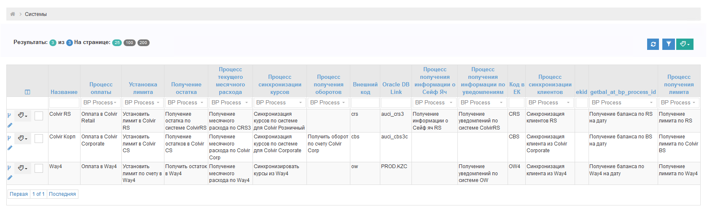
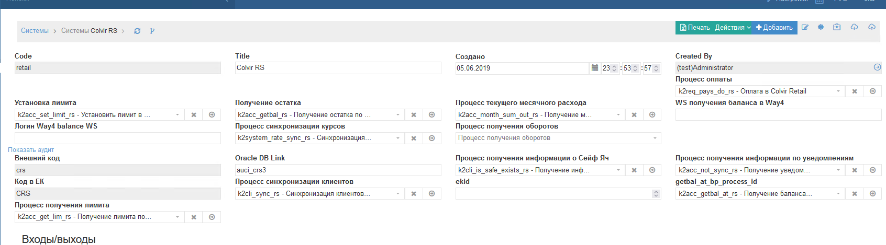

Системы
==================================================================================================

Данный раздел описывает сущности и процессы по системам

ПО КО разработана таким образом, чтобы можно было прозрачно вести реестр АБС систем и в них прописаны все доступные процессы.

Скриншот экранной формы Список систем. В данном списке отражены 3 АБС системы:

Скриншот экранной формы детализация системы:

  
  
Описание полей систем
---------------------------

**Установка лимита** - здесь выбран процесс установки лимита по счету в АБС

**Получение остатка** - здесь выбран процесс получения остатка по счету в АБС

**Процесс текущего месячного расхода** - здесь выбран Процесс текущего месячного расхода по счету в АБС

**Процесс оплаты** - здесь выбран Процесс оплаты в АБС

**Процесс синхронизации курсов валют** - Процесс синхронизации курсов валют в АБС

**Процесс получения лимита** -  здесь выбран процесс получения лимита по счету в АБС

Процессы по системам
---------------------------

..   
	Сформирована через БП sphinx_sql_to_table
	select code "код_процесса",title "наименование_процесса" from bp_processes where 
    code like 'k2%_rs'
    or
    code like 'k2%_cs'
    or
    code like 'k2%_w4'

.. list-table:: Процессы по системам
   :header-rows: 1

   * - код_процесса
     - наименование_процесса
   * - k2acc_get_lim_cs
     - Получение лимита по Colvir BS
   * - k2acc_get_lim_rs
     - Получение лимита по RS
   * - k2acc_get_lim_w4
     - Получение лимита по Way4
   * - k2acc_get_lmit_rs
     - Получить Лимит в RS
   * - k2acc_getbal_at_cs
     - Получение баланса по BS на дату
   * - k2acc_getbal_at_rs
     - Получение баланса по RS на дату
   * - k2acc_getbal_at_w4
     - Получение баланса по Way4 на дату
   * - k2acc_getbal_cs
     - Получение остатков в Colvir CS
   * - k2acc_getbal_rs
     - Получение остатка по системе ColvirRS
   * - k2acc_getbal_w4
     - Получить остаток в Way4
   * - k2acc_getmov_cs
     - Получить оборот по счету Colvir Corp
   * - k2acc_lock_acc_cs
     - Заблокировать счет в колвир корпоративный
   * - k2acc_lock_acc_rs
     - Заблокировать счет в Колвир Розничный
   * - k2acc_lock_acc_w4
     - Заблокировать счет в Way4
   * - k2acc_lock_unlock_acc_cs
     - Разблокировать счет в Colvir Корпоративный
   * - k2acc_lock_unlock_w4
     - Разблокирование счета Way4
   * - k2acc_month_sum_out_cs
     - Получение месячного расхода по Colvir Corp
   * - k2acc_month_sum_out_rs
     - Получение месячного расхода по CRS3
   * - k2acc_month_sum_out_w4
     - Получение месячного расхода по Way4
   * - k2acc_not_sync_rs
     - Получение уведомлений по системе ColvirRS
   * - k2acc_not_sync_w4
     - Получение уведомлений по системе OW
   * - k2acc_set_limit_cs
     - Установить лимит в Colvir CS
   * - k2acc_set_limit_rs
     - Установить лимит в Colvir RS
   * - k2acc_set_limit_w4
     - Установить лимит по счету в Way4
   * - k2acc_unlock_acc_rs
     - Разблокировать счет в Colvir Розничный
   * - k2cli_is_safe_exists_rs
     - Получение информации о Сейф яч RS
   * - k2cli_sync_cs
     - Синхронизация клиента из Colvir Corporate
   * - k2cli_sync_rs
     - Синхронизация клиентов RS
   * - k2cli_sync_w4
     - Синхронизация клиента из Way4
   * - k2get_accs
     - Получить список всех счетов по всем системам по Клиенту
   * - k2import_overdue_rs
     - k2import_overdue_rs
   * - k2req_pay_rscs_to_w4
     - Перекидка в Way4
   * - k2req_pay_w4
     - Оплата в Way4
   * - k2req_pay_w4_to_rscs
     - Перекидка из Way4 в RS,CS
   * - k2req_pays_do_cs
     - Оплата в Colvir Corporate
   * - k2req_pays_do_rs
     - Оплата в Colvir Retail
   * - k2req_try_pay_accs
     - Запуск оплаты по счетам требования
   * - k2system_get_acc_cs
     - Получить счета из ColvirBS (depreacted)
   * - k2system_get_acc_rs
     - Получить счета из Colvir RS (deprecated)
   * - k2system_get_acc_w4
     - Получить счета из Way4
   * - k2system_rate_sync_cs
     - Синхронизация курсов по системе для Colvir Corporate
   * - k2system_rate_sync_rs
     - Синхронизация курсов по системе для Colvir Розничный
   * - k2system_rate_sync_w4
     - Синхронизировать курсы из Way4
